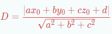

# Scipy

## 点群から平面を求める
leastsqを使って点群から平面方程式を得ます。leastsqは与えた評価関数の出力の2乗誤差を最小化します。
### コード
~~~
# Calcurates the equation of plane as 
#    ax+by+cz+d=0
# from Point clouds

import open3d as o3d
import numpy as np
from scipy import optimize

def error(param,data):
  den=np.linalg.norm(param[:3])
  vars=np.vstack((data.T,np.ones(len(data))))
  return np.abs(param.dot(vars))/den

######Making input data
mesh=o3d.geometry.TriangleMesh.create_box(width=100, height=100, depth=0.001)
pcd=mesh.sample_points_uniformly(number_of_points=10000)
points=np.array(pcd.points
noise=np.random.normal(0,1,(len(points),3))
points=points+noise
pcd.points=o3d.utility.Vector3dVector(points)

#o3d.visualization.draw_geometries([pcd])
param=np.array([1,1,1,1])
result=optimize.leastsq(error,param,points)

print(result[0])
arg=result[0]/np.linalg.norm(result[0][:3])
print(arg)
~~~

### 解説
#### leastsq呼出し
~~~
param=np.array([1,1,1,1])
result=optimize.leastsq(error,param,points)
print(result[0])
~~~
errorは評価関数です(後述)。  
paramは平面方程式の係数[a,b,c,d]の初期値を与えます。
pointsは点群データ[[x0,y0,z0],[x1,y1,z1]....]です。
scipyの配列はnumpyとも共通なので、全部numpyで書いておくと便利です。
結果はresultの1番目の要素に[a,b,c,d]の最適値が入ります、2番目は良く分からないのですが、0だとエラーみたいです。

#### 評価関数
~~~
def error(param,data):
  den=np.linalg.norm(param[:3])
  vars=np.vstack((data.T,np.ones(len(data))))
  return np.abs(param.dot(vars))/den
~~~
paramにて平面方程式の係数[a,b,c,d]、dataにて点群[[x0,y0,z0],[x1,y1,z1]....]を与えます。これは前述のleastsq呼出し時の第2、第3引数に当ります。paramは呼び出される度ごとに最適値に変化します。
評価関数はdataの１要素に対するスカラー量でなければなりません。公式はこれ。

ここでは戻り値として平面と点の距離をリストにして返します。
~~~
den=np.linalg.norm(param[:3])
~~~
距離公式の分母です。paramの3番目まで[a,b,c]のノルムなので、normを使って記述しています。
~~~
vars=np.vstack((data.T,np.ones(len(data))))
return np.abs(param.dot(vars))/den
~~~
分子はベタに書いても書けますが、[a,b,c,d]と[[x],[y],[z],[1]]の内積(.dot)でオシャレに記述しています。

## ロボットキャリブレーション
たぶんTsai法と同じ・・・
### コード
~~~
#!/usr/bin/env python3

import cv2
import numpy as np
from rovi_utils import tflib 
import copy
from scipy import optimize
import itertools

Weight=1

def fit_func(prm,M1,P1,M2,P2):
  R,jacob=cv2.Rodrigues(np.array([prm[3],prm[4],prm[5]],dtype=float))
  T=np.array([prm[0],prm[1],prm[2]]).reshape((3,1))
  mTc=np.vstack((np.hstack((R,T)),np.array([0,0,0,1]).reshape((1,4))))
  bTm1=tflib.toRTfromVec(M1)
  cTp1=tflib.toRTfromVec(P1)
  bTm2=tflib.toRTfromVec(M2)
  cTp2=tflib.toRTfromVec(P2)
  bTp1=np.dot(np.dot(bTm1,mTc),cTp1)
  bTp2=np.dot(np.dot(bTm2,mTc),cTp2)
  terr=np.linalg.norm(bTp1[:3,3]-bTp2[:3,3])
  xerr=np.linalg.norm(bTp1[:3,0]-bTp2[:3,0])
  yerr=np.linalg.norm(bTp1[:3,1]-bTp2[:3,1])
  zerr=np.linalg.norm(bTp1[:3,2]-bTp2[:3,2])
  return terr+(xerr+yerr+zerr)

def solve(M,P):
  alen=np.linalg.norm(M[:,:3],axis=1)
  Weight=np.mean(alen)
  print("weight",Weight)
  Mn=copy.copy(M)
  Pn=copy.copy(P)
  Mn[:,:3]=Mn[:,:3]/Weight
  Pn[:,:3]=Pn[:,:3]/Weight
  mat=np.hstack((Mn,Pn))
  Cmat=np.asarray(list(itertools.combinations(mat,2)))
  Dat1=Cmat[:,0,:]
  Dat2=Cmat[:,1,:]
  M1=Dat1[:,:7].T
  P1=Dat1[:,7:14].T
  M2=Dat2[:,:7].T
  P2=Dat2[:,7:14].T
  result=optimize.leastsq(fit_func,[0,0,0,0,0,0],args=(M1,P1,M2,P2),maxfev=100000,ftol=0.000001)
  if result[1] not in [1,2,3,4]:
    print("rcalib_solver::scipy::optimize failed")
    return None
  result=np.asarray(result[0])
  result[:3]=result[:3]*Weight
  print("solve result",result)
  R,jacob=cv2.Rodrigues(result[3:6])
  T=result[0:3].reshape((3,1))
  RT=np.vstack((np.hstack((R,T)),np.array([0,0,0,1]).reshape((1,4))))
  return RT
~~~
### 入力データ  
Mがロボット位置姿勢(ベース)、Pがボードの位置姿勢(カメラ)です。それぞれ１要素は直交座標とQuaternionで[x,y,z,Qx,Qy,Qz,Qw]のように表現され、この配列(数か所から撮影した結果)が入力です。

### 評価関数  
ロボットの位置姿勢が変わってもボード位置姿勢は不動、という条件を使います。ボード(添え字P)の位置姿勢は  
BTP=BTMMTCCTP  
となります。2つのこの式の入力の差を評価関数の戻り値とします。

### 入力データ組み合わせ
~~~
mat=np.hstack((Mn,Pn))
Cmat=np.asarray(list(itertools.combinations(mat,2)))
~~~
matは、撮影箇所ごとのＭ,Ｐをくっつけた配列です。撮影箇所がＮあれば(N,14)の配列です。
ひとつの評価値を得るには２箇所のデータが必要なので、matから[Mi,Pi,Mj,Pj]を作ります。Ｎ個のデータがあればNC2のデータ組が得られます。NC2はitertoolsのcombinationにて記述できます。
